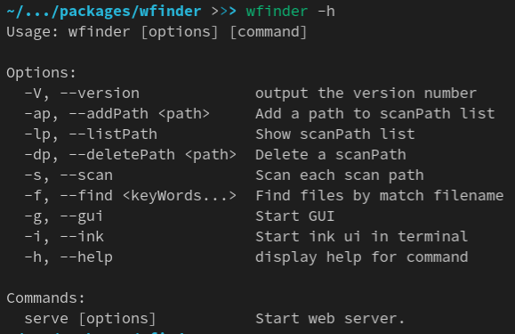
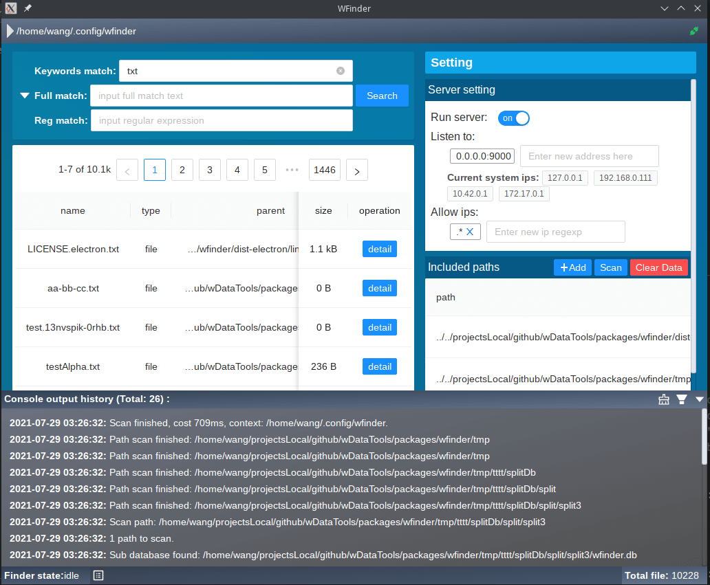

# Wfinder
A local file indexing and searching tool supports cli and multi desktop platforms (Linux, Mac OS, Windows).

---

## Features
1. Flexible database file position:
    - Database file of per scan path can be stored in scan path or current launched wfinder root.
    - Support sub database in scan path, which will be a child node of current wfinder, keeps isolated settings and other datas.

2. Http server:

    Run one or more http server to serve most of wfinder features, including search, scan and settings.

3. Remote connection:

    You can add mulity remote wfinder server url to setting, so that datas of remote wfinders can be searched together with local datas.

4. Support database contexts, both locally and remotely.

    You can switch to any database or sub database remotely
or locally to search, modify settings or trigger scanning.

5. An output pannel to check errors, warnings, scanning progress, etc.

6. Multify platform supports. 

    Wfinder can be launched in terminal with cli commands or simple "ink-ui" for basic usages in limited  environment. Or launched with desktop gui and web ui for more features and better experience.

---

## Install
1. Install using npm:
```sh
# Install without cli commands, ink gui and web gui:
npm install -g wfinder

# If you want electron gui (desktop platforms)
# You should install electron too.
npm install -g electron
# Or just install wtoolbox, which contains wfinder
# If wfinder has been installed, uninstall it first!
npm install -g wtoolbox
```
2. Install using binary package:
Download binary package you want from release page.

---
## User interfaces
1. Single line commands: 


2. Ink ui:
```sh
# Launch command:
wfinder -i
```


3. GUI:
```sh
# Launch command:
wfinder -g
```

3. HTTP server:
```sh
# The user interface is similar to GUI above.
# Launch command:
wfinder serve
```
