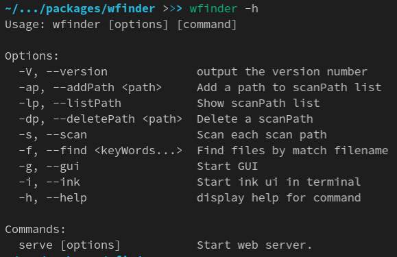
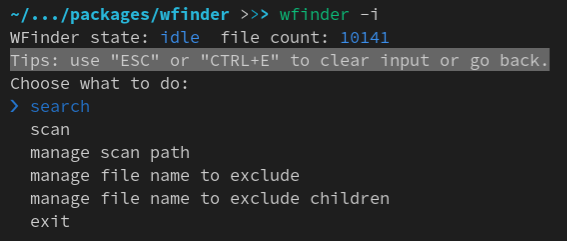

# Wfinder
一个本地文件索引和搜索工具，支持cli界面和多个桌面平台 (Linux, Mac OS, Windows).

[English](README.md) | 中文

---

## 功能
1. 灵活的数据文件存储位置:
    - 每个单独的扫描路径都可选将数据存储在扫描路径下或者当前运行的wfinder目录下。
    - 支持扫描路径下的子数据库。扫描路径下的子数据库作为当前运行的wfinder的子节点独立存储设置和数据。

2. Http 服务:

    可运行一个或几个http服务，以web方式提供大部分功能，包括搜索、扫描和修改设置。

3. 远程连接:

    可添加远程wfinder的url到设置项中，以便同时搜索本地和远程的文件。

4. 支持本地和远程数据库上下文切换:

    支持切换到所有的本地和远程的主数据库、子数据库，以便对其进行搜索、设置、扫描操作。

5. 一个输出面板以供查看错误、提醒、扫描进度等信息。

6. 支持多个平台:

    支持在控制台以命令行或简单的“ink-ui”在受限的环境中使用基本功能。支持在桌面环境和web中提供更完善的功能和更好的用户体验。

---

## 安装
1. 使用 npm 安装:
```sh
# 安装控制台命令、ink gui 和 web:
npm install -g wfinder

# 需要同时安装electron已支持桌面平台的gui.
npm install -g electron
# 或者直接安装wtoolbox，wtoolbox包含了wfinder
# 如果已经安装了wfinder，需要先将其移除!
npm install -g wtoolbox
```
2. 使用二进制安装包安装:

    从release页面下载所需的安装包: 
    https://github.com/wCodeBase/wDataTools/releases/tag/wfinder-0.0.1-alpha-1.

---
## 用户界面
1. 控制台命令: 



2. Ink ui:
```sh
# 启动命令:
wfinder -i
```


3. 图形界面:
```sh
# 启动命令:
wfinder -g
```


4. HTTP 服务:
```sh
# HTTP服务的界面和上面的图形界面类似.
# 启动命令:
wfinder serve
```
